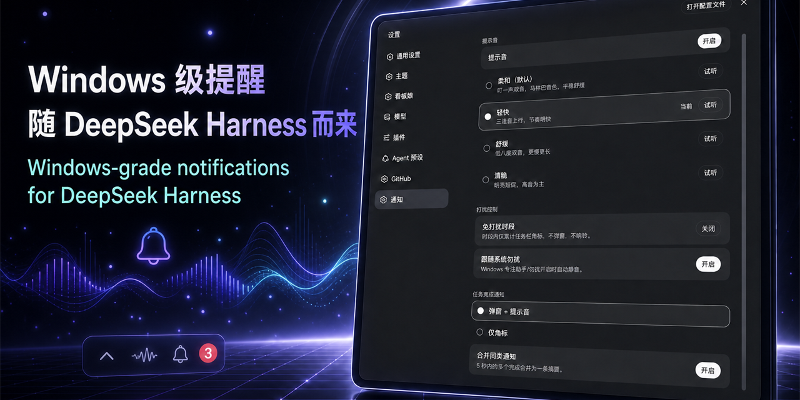

# dsh-windows-notify

**Windows 级提醒,随 DeepSeek Harness 而来。** Windows-grade notifications for DeepSeek Harness — system toasts, custom sounds, and a crisp taskbar bubble badge (no extra tray icon) for pending decisions and unread completions, installed as a **native DSH profile plugin** (zero patching of built-in packages).



> 任务完成或需要你决策时:系统 Toast + 提示音 + 任务栏托盘角标(待查看数量)。免打扰时段、跟随系统勿扰、四套自制提示音、完成合并摘要,全部可在设置页调整,保存即生效。

## 功能特性 / Features

- **完成提醒** — 根 Agent 回合结束(running→idle)时弹 Toast;支持「仅角标」模式与 5 秒合并摘要(`DSH 任务完成 ✅(N)`)。
- **决策提醒** — `ask_user_question` 提问时弹「DSH 需要你的决定 ❓」,带问题与选项列表;回答/取消后托盘角标自动 -1。
- **托盘角标** — 任务栏托盘图标右上角红色气泡 = 待回复决策 + 已完成未查看;单击托盘打开 GUI 并清零已完成;DSH 退出后托盘经端口看门狗自行退出。
- **四套提示音** — 柔和/轻快/舒缓/清脆(自制合成,零版权风险),设置页可试听;提示音可整体关闭。
- **打扰控制** — 免打扰时段(支持跨午夜窗口,时段内仅累计角标);跟随 Windows 专注助手/勿扰自动静音。
- **原生插件机制** — profile bundle + settings 命名空间 + webServer 路由;不修改任何内置包文件,DSH 升级后重跑安装脚本即可。

## 安装 / Install

### 方式一:源码接线(推荐,无需 pnpm)

```powershell
# 在仓库根目录
.\install.ps1            # 等价于 node install.mjs
```

脚本(幂等)会:初始化 profile(缺失时按 web/headless 模板生成)→ 在
`$DSH_HOME\profiles\<profile>\node_modules\dsh-windows-notify` 建 junction →
把 `dsh-windows-notify` 写入 profile 的 `dsh.profile.bundles` 与 `dependencies`
→ 可选迁移旧配置。**重启 DSH 生效**。

常用参数:`--profile <name>`(默认 web)、`--dsh-home <dir>`、
`--keep-legacy`(从旧版 apply-patch 扩展迁移时跳过还原)、
`--legacy-root <dir>`(从旧版扩展迁移时指定 DSH 安装的 `@deepseek-ai` 目录,从 npm registry 拉取同版本官方文件还原旧补丁)。

### 方式二:pnpm(pnpm 用户)

```powershell
dsh plugin --profile web add dsh-windows-notify
```

### 卸载 / Uninstall

```powershell
.\uninstall.ps1          # 等价于 node install.mjs --uninstall
```

删除 junction 与 manifest 条目后重启即可;settings 里的 `dsh-notify` 配置保留,重装后继续有效。

## 配置 / Configuration

设置页「通知」区段(settings 命名空间 `dsh-notify`),保存即生效:

| 键 | 默认 | 说明 |
| --- | --- | --- |
| `sound` | `soft` | `soft` / `brisk` / `calm` / `crisp` |
| `soundEnabled` | `true` | 提示音总开关 |
| `quietHours.enabled` / `start` / `end` | `false` / `22:00` / `08:00` | 免打扰时段(支持跨午夜) |
| `respectSystemDnd` | `true` | 跟随 Windows 专注助手/勿扰 |
| `completeMode` | `toast` | `toast` 弹窗 / `badge-only` 仅角标 |
| `completeMerge` | `true` | 5 秒窗口内合并完成摘要 |

环境变量:`DSH_NOTIFY=0` 整体禁用;`DSH_NOTIFY_SOUND=<wav路径>` 覆盖音效;`DSH_NOTIFY_MIN_INTERVAL_MS` 节流间隔。

## 架构 / How it works

- **`cordis.patch.yml`** — bundle 补丁层,向 profile 组合插入一行 `dsh-notify`(单包双面 `dsh.bundle` + `dsh.client`)。
- **宿主半边 `lib/index.js`** — `agent/status` 事件(回合结束)→ 完成通知(过滤子代理与 goal 自动续跑);包装 `userQuestions.ask()` → 决策提醒 + 角标 ±1;`ctx.settings.register` 注册命名空间 `dsh-notify`(持久化到 `$DSH_HOME/settings.yaml`,schema 校验);`webServer.register` 注册 `GET/POST /api/dsh-notify/config`(设置页读写)与 `/api/dsh-notify/preview`(试听);旧 apply-patch 钩子共存守卫。
- **浏览器半边 `lib/client.js`** — 手写 `__ModuleLoader__` 工厂(零构建步骤),设置页「通知」区段经插件自有 HTTP 路由读写配置(DSH rc.6 的 apiproxy 只暴露白名单 settings 命名空间,第三方命名空间须走自有路由,详见 CHANGELOG 1.1.0)。
- **通知内核 `lib/notify-core.js`** — Toast/托盘脚本经 Base64 JSON 载荷传递(Windows spawn 不转义参数)、PowerShell 绝对路径、不用 detached/unref、全程 best-effort。
- **脚本** — `toast.ps1`(WinRT Toast + SoundPlayer.PlaySync + 免打扰/系统勿扰静音)、`tray.ps1`(任务栏气泡角标:ITaskbarList3 原生 overlay,4x 超采样抗高 DPI 模糊;端口看门狗 + 按端口独立锁 + 窗口前台自动清未读)。

## 数据与隐私 / Data & privacy

- 配置存于 DSH 托管设置文档(`$DSH_HOME/settings.yaml` 的 `dsh-notify` 节);
- 运行状态(托盘角标计数、调试日志)仅写本机 `$DSH_HOME/dsh-windows-notify/`;
- **不联网、无遥测、不读取任何凭据**;仅 `install.mjs --legacy-root` 在还原旧补丁时从 npm registry 拉取同版本官方包;
- 插件注册两条本机 HTTP 路由:`/api/dsh-notify/config`(设置页读/写配置,仅同源可访问)与 `/api/dsh-notify/preview`(试听);不向外部发送任何数据;
- 纯 Windows:非 win32 平台所有提醒自动跳过。

## 已知限制 / Known limitations

- 仅提醒、不携带按钮(Windows 对未打包应用不支持 Toast 按钮激活);
- bundle 补丁不热加载,安装/升级后需重启 DSH;
- 需要 Windows 10/11(Toast 与托盘依赖 WinRT/NotifyIcon)。

## 开发 / Development

```bash
npm ci
node test.mjs     # 语法/YAML/JSON/资产/BOM/路径泄露校验
node pack.mjs     # dist/ 下生成 tgz 与 zip
```

要求:Node ≥ 18;PowerShell 脚本须为 UTF-8 BOM(中文文本),`.bat` 须纯 ASCII。CI 见 `.github/workflows/`(push/PR 校验 + tag 自动 Release)。

## License

[MIT](LICENSE) © 2026 Sutera-Diffusus
